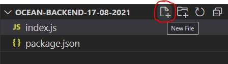

# Get Started a new project on Gitpod.io

1. Access the Gitpod.io site and effect your login (ways: GitLab, GitHub ou Bitbucket).
   https://gitpod.io/login/
   (I'm doing used GitHub)

2. Concluded the login, access this URL:
   https://www.gitpod.io/#https://github.com/paulosalvatore/nodejs-clean-template

3. For start, go to the terminal and type the following command:

   - ```bash
     node index.js
     ```

   - The output is:

      - ```
       gitpod /workspace/nodejs-clean-template $ node index.js
       Hello, world!
       ```

#  Get Started a new NodeJS project on VSCode installed at yourself machine.

1. Created a folder in your PC, preferably, example:

```bash
C:\GitHub\CarlosViniMSouza\ocean-backend-17-08-2021
```

2. Click in `Files > Open Windows PowerShell how to administrator` and white the follow command:

   - ```bash
     code .
     ```

   - **Optionally**, if you checked the option to add the VSCode in the path menu, you can just click
   - with the right button on the folder and click on `Abrir com Code` and skip this step of April the 
   - terminal/enter command `code.`

3. The VSCode should open. Click in `Terminal > New terminal`.

4. On terminal, type the follow command:

   - ```bash
     npm init -y
     ```

   - This command should create the file `package.json` with an initial content.

6. Click on bottom `New file` and enter `index.js`

   - 

7. type the follow code:

   - ```javascript
     console.log("Hello, world!")
     ```

8. Save the file, click on the terminal, type the following command and run:

   - ```bash
     node index.js
     ```

   - We're having the follow output:

      - ```
       C:\GitHub\SamsungOcean\ocean-backend-17-08-2021>node index.js
       Hello, world!
       ```